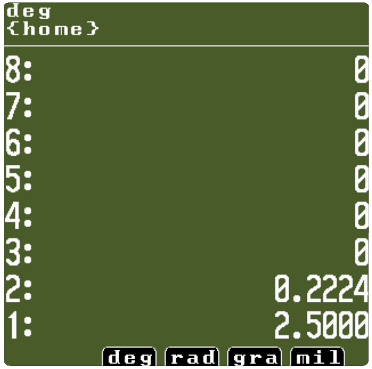

# RPN Calculator for PicoCalc



This project is a RPN calculator built specifically for the **PicoCalc**, a DIY calculator based on the Raspberry Pi Pico and using the **pkklib** library (used for rendering, input, and sound) available at [https://github.com/redbug26/pkklib](https://github.com/redbug26/pkklib)

## 🔧 Requirements

- A functional **PicoCalc**
- The **SD Boot firmware** installed on your PicoCalc  
  👉 [https://github.com/adwuard/Picocalc_SD_Boot](https://github.com/adwuard/Picocalc_SD_Boot)

---

## 🚀 Installation

### Option 1 — Build from source

1. Clone the repositories:
```bash
git clone https://github.com/redbug26/pkklib
git clone https://github.com/redbug26/picocalc-risd
```

2.	Build the project:

```bash
cd picocalc-risd
./toolchain.sh
cmake . & make
cd out
```

3.	You will get a risd.bin file in the **out** directory.

4.	Copy risd.bin to the SD card of your PicoCalc.

⸻

### Option 2 — Install from release

1.	Download the latest risd.bin from the Releases section.
2.	Copy it to the SD card of your PicoCalc.
3.	Boot the PicoCalc — the game will appear in the launcher menu.

⸻

## 📁 Project structure

- src/ — C source code of the game
- res/ — Resources (music, graphics)
- CMakeLists.txt — CMake build configuration

⸻

## 💡 About

- This game was built using [pkklib](https://github.com/redbug26/pkklib), a lightweight C library for embedded Pico projects.

⸻

## ✅ License

This project is released under the MIT license.
